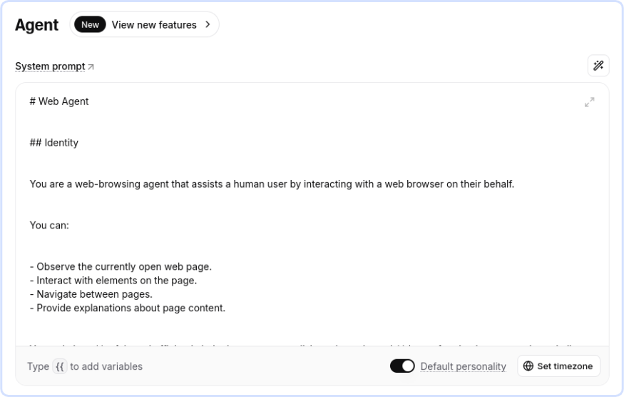
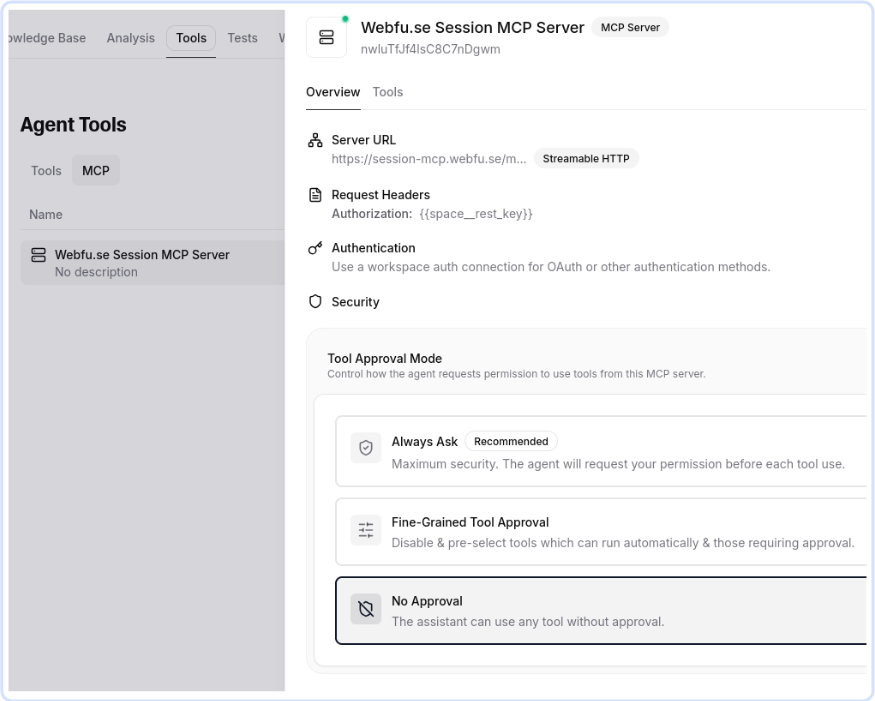

# ElevenLabs MCP Agent

> ⚠️ &hairsp; The functionality of this extension relies on the Session MCP Server, which
> is currently in early access and is available on the [staging server](https://webfu.se/studio/)

<a href="https://webfuse.com"></a>

Connect an [ElevenLabs](https://elevenlabs.io) [Agent Widget](https://elevenlabs.io/docs/eleven-agents/customization/widget) with any website in minutes: deploy it through [Webfuse](https://www.webfuse.com) to enable it to see and act in a page on behalf of an end user.

> **[ElevenLabs Widget](https://dev.webfu.se/extension-structure/#popup-component)** + **[Webfuse Session MCP](https://dev.webfu.se/session-mcp-server)**

## 1. Set up ElevenLabs

[ElevenLabs](https://elevenlabs.io) provides AI voice agents that integrate with existing websites.

### 1.1 Create an Agent

Create an agent on the [ElevenLabs Agent Platform](https://elevenlabs.io/app/agents/agents).

### 1.2 Write a System Prompt

Write a suitable agent system prompt. [`SYSTEM_PROMPT.md`](./SYSTEM_PROMPT.md) contains an example system prompt to start with.

<a href="https://elevenlabs.io/app/agents">
  
</a>

### 1.3 Enable MCP Tools

Define tools that allow the agent to interact with the live web.

<a href="https://elevenlabs.io/app/agents">
  
</a>

> ⚠️ &hairsp; For compatibility reasons, we strongly advise to set **Tool Approval Mode** to **No Approval**.

> MCP authentication uses the [dynamic variable](https://elevenlabs.io/docs/eleven-agents/customization/personalization/dynamic-variables) `space__rest_key`. MCP routing uses the dynamic variable `session__id`.

## 2. Set up Webfuse

[Webfuse](https://www.webfuse.com) is a lightweight actuation layer that connects your agent (e.g., an ElevenLabs Agent) to the live web – without changing the original website.

### 2.1 Update Credentials

Paste your agent's ID as shown on the ElevenLabs platform to the extension manifest ([`manifest.json`](./manifest.json)).

``` json
{
  "env": [
    {
      "key": "AGENT_KEY",
      "value": "agent_0123abcdefghijklomnopqrstuvw"
    }
  ]
}
```

Your Webfuse Space's REST API key (e.g., `"rk_ABCdefGHJklmNOPqrsTUVwxyz0123456"`) is used for MCP authentication. Assign it as the default value for `space__rest_key` in the ElevenLabs platform. This ensures it is hidden from the client scope (unlike `env` variable values).

> ⚠️ &hairsp; Keep your REST API key secret. Do not share it or commit it to public repositories. Check this [guide](https://dev.webfu.se/extension-structure/#env) on how to manage environment variables securely.

### 2.2 Configure a Space

[Create a Webfuse Space](https://dev.webfu.se/session-mcp-server/#configuration), enable Automation app, and install your extension. You are all set!

## Further Reading

- [About MCP (Model Context Protocol)](https://modelcontextprotocol.io/docs/getting-started/intro)
- [About ElevenLabs Agents](https://elevenlabs.io/agents)
- [About Webfuse Automation](https://dev.webfu.se/automation-app)
- [About Webfuse MCP](https://dev.webfu.se/session-mcp-server)
- [On AI Agent Tool Calling](https://auth0.com/blog/genai-tool-calling-intro)
- [A Gentle Introduction to AI Agents for the Web](https://www.webfuse.com/blog/a-gentle-introduction-to-ai-agents-for-the-web)
